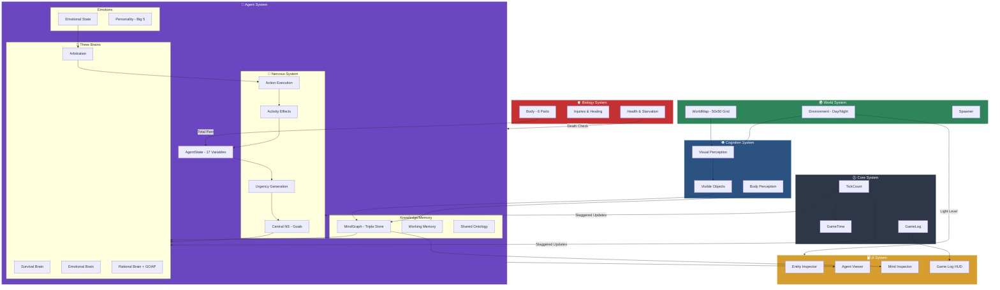
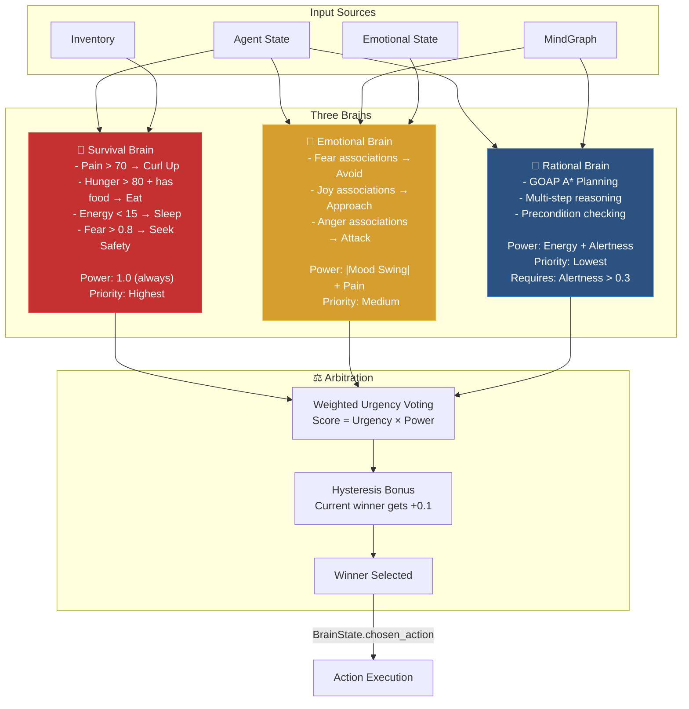
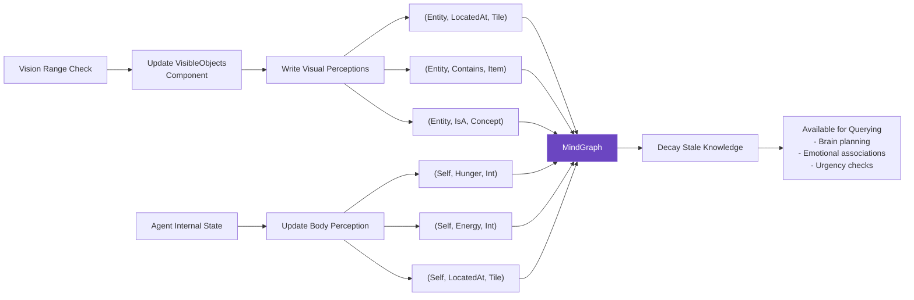
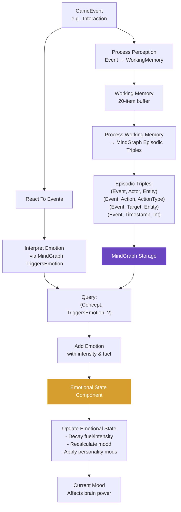
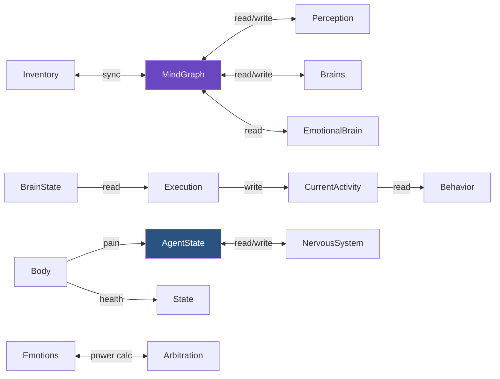

# WorldSim Systems Architecture

> **Last Updated**: 2025-12-14
> **Purpose**: Comprehensive documentation of all systems and their interconnections

---

## Table of Contents
1. [High-Level Architecture](#high-level-architecture)
2. [Core Systems](#core-systems)
3. [Data Flow](#data-flow)
4. [System Interconnections](#system-interconnections)
5. [Shared Data Structures](#shared-data-structures)
6. [Architectural Patterns](#architectural-patterns)

---

## High-Level Architecture



---

## Core Systems

### 🕐 Core System
**Location**: `src/core/`

**Purpose**: Fundamental simulation infrastructure that provides timing, logging, and lifecycle management.

#### Components

**TickCount** (`tick.rs`)
- Manages simulation ticks at configurable rates (default: 60 ticks/second)
- Supports pause/resume functionality
- Provides staggered update scheduling to distribute entity processing across frames
- Prevents all entities from updating simultaneously

**GameTime** (`time.rs`)
- Converts tick count to in-game time (days, hours, minutes, seconds)
- Simulation starts at 12:00 noon
- Provides formatting utilities for time display

**GameLog** (`log.rs`)
- Centralized logging system with categories:
  - Event logging
  - Action tracking
  - Perception updates
  - Brain decision logging

---

### 🌍 World System
**Location**: `src/world/`

**Purpose**: Physical environment and spatial management.

#### Components

**WorldMap** (`map.rs`)
- 50×50 tile grid system
- Tile size: 16 pixels
- Provides walkability checks
- Coordinate conversion utilities (world ↔ tile)

**Environment** (`environment.rs`)
- Day/night cycle simulation
- Light levels affect vision range dynamically
- Background color transitions based on time of day

**Spawner** (`spawner.rs`)
- Entity creation and placement in the world
- Handles initial world population

---

### 🫀 Biology System
**Location**: `src/biology/`

**Purpose**: Physical body simulation and health management.

#### Components

**Body** (`body.rs`)
- 6 body parts: Head, Torso, Left/Right Arms, Left/Right Legs
- Each part tracks:
  - Current HP
  - Max HP
  - Active injuries
  - Function rate (0-1)

**Injuries**
- Types: Cut, Bruise, Fracture, Burn, Infection
- Properties: Severity, pain level, healing rate
- Natural healing over time
- Scarring: Permanent max HP reduction after healing

**Health & Starvation**
- Health damage when hunger ≥ 90
- Death occurs when health ≤ 0
- Entity despawns on death

**Pain Aggregation**
- Combines pain from all body parts and injuries
- Feeds into AgentState.Pain variable
- Affects mood and behavior

---

### 👁️ Cognition System
**Location**: `src/cognition/`

**Purpose**: Perception and sensory processing.

#### Components

**Visual Perception** (`perception.rs`)
- Range-based entity detection
- Vision range modified by environmental light level
- Range-based entity detection
- Vision range modified by environmental light level
- Updates VisibleObjects component
- Updates VisibleObjects component
- **Continuous Execution**: Runs every tick to ensure immediate reaction to environmental changes.

**Perception Writing**
- Writes beliefs to MindGraph:
  - `(Entity, LocatedAt, Tile)`
  - `(Entity, Contains, Item)`
  - `(Entity, IsA, Concept)`
  - `(Chunk(i32, i32), Explored, Boolean(true))` (Memory of visited areas)

**Body Perception**
- Self-awareness of internal state
- Monitors hunger, energy, pain
- Writes self-state to MindGraph:
  - `(Self, Hunger, Int)`
  - `(Self, Energy, Int)`
  - `(Self, LocatedAt, Tile)`
- Staleness detection for outdated beliefs

---

## Agent System

The most complex system with multiple interconnected subsystems.

### 📊 AgentState
**Location**: `src/agent/state.rs`

Unified state container with **17 variables**:

**Physical Needs** (0-100)
- Hunger
- Thirst
- Energy
- Health
- Pain

**Psychological Drives** (0-1)
- Social
- Fun
- Curiosity
- Status
- Security
- Autonomy

**Mental State**
- Stress (0-100)
- Alertness (0-1)

**Emotions** (0-1)
- Fear
- Anger
- Joy
- Sadness

---

### 🧠 Knowledge & Memory System
**Location**: `src/agent/knowledge.rs`, `src/agent/memory.rs`

#### MindGraph - Triple Store Knowledge Base
A semantic network using Subject-Predicate-Object triples.

**Node Types**:
- Entity, Concept, Tile, Event, Self, Action, Chunk((x,y))

**Predicate Types**:
- IsA, HasTrait, LocatedAt, Contains, Affords, TriggersEmotion, etc.

**Indexing**:
- O(1) functional predicate lookups
- HashMap indexing by (subject, predicate)
- Shared ontology (Arc-wrapped universal truths)

**Memory Types** (different decay rates):
- Intrinsic (permanent traits) - Never decays
- Cultural (learned social rules) - Very slow decay (2× semantic half-life)
- Semantic (general knowledge) - Essentially permanent (10 hour half-life)
- Episodic (experienced events) - 5 minute base half-life, extended by salience
- Procedural (how-to knowledge) - Never decays
- Perception (sensory beliefs) - 30 second base half-life

**Decay Implementation** (`src/agent/memory.rs`, `src/agent/nervous_system/config.rs`):
- Exponential decay: `strength = 0.5^(age / half_life)`
- Salience extends half-life: `adjusted_half_life = base × (1 + salience × 2.0)`
- Forgotten when strength < 0.1 (10% threshold)
- High-salience (emotional) memories last 3× longer
- Configurable via `MemoryDecayConfig` resource

**Metadata**:
- Source (perception, inference, cultural)
- Confidence level
- Timestamp
- Salience
- Evidence links

#### WorkingMemory
- 20-item circular buffer
- Holds recent perceptions
- Feeds into MindGraph for long-term storage

---

### 😊 Emotions System
**Location**: `src/agent/emotions.rs`

**Active Emotions**
- Intensity: Current felt strength
- Fuel: Duration reservoir (depletes over time)

**Stress System**
- **Accumulation**: Builds up from unmet needs and negative states:
  - Hunger > 50%
  - Energy < 50%
  - Total Pain
  - Negative Emotion Intensity
- **Decay**: Naturally decays over time.
  - Recovery Bonus (2x) when well-fed (Hunger < 30) and rested (Energy > 70).
- **Effects**:
  - Amplifies Emotional Brain power
  - Reduces Rational Brain power
  - Triggers "The Snap" (Survival Brain takeover) at 90+

**Mood Calculation**
```
Mood = (emotion valence + personality baseline) - pain penalty
```

**Personality Modifiers**
- Neuroticism amplifies negative emotions
- Introversion reduces social joy
- Agreeableness affects fear→anger conversion

**Event-Driven Emotions**
- MindGraph associations trigger emotions
- `(Concept, TriggersEmotion, EmotionType)` triples

---

### 🧬 Personality
**Location**: `src/agent/personality.rs`

**Big Five Traits** (0-1 scale):
- Openness
- Conscientiousness
- Extraversion
- Agreeableness
- Neuroticism

Modulates emotional responses and baseline mood.

---

### 🎒 Inventory
**Location**: `src/agent/inventory.rs`

- Items stored by Concept (Apple, Stick, Stone, etc.)
- Quantity tracking
- Unified with MindGraph via:
  - `(Self, Contains, Item(Concept, qty))`

---

## Three Brains Architecture

**Location**: `src/agent/brains/`

Inspired by triune brain theory - three parallel decision-making systems.



### 🚨 Survival Brain
**Location**: `src/agent/brains/survival.rs`

**Role**: Reactive emergency responses

**Triggers** (checked in order):
1. **The Snap**: Stress > 90 → Desperate Action (Eat/Sleep/Hide)
   - Takes over completely regardless of specific urgency
   - "I can't take it anymore!" response
2. Pain > 70 → Curl Up (with hysteresis to prevent thrashing)
3. Hunger > 80 + has food → Eat Nearest Food
4. Energy < 15 → Sleep Here
5. Sleeping + Energy > 90 → Wake Up
6. Fear > 0.8 → Seek Safety

**Characteristics**:
- No planning required
- Ignores social rules
- Highest urgency ratings
- Always active (power = 1.0)
- Can trigger "The Snap" at extreme stress levels
- **Config-Driven Reflexes**: Defined in declarative `SurvivalReflex` structs.

---

### 💭 Emotional Brain
**Location**: `src/agent/brains/emotional.rs`

**Role**: Association-driven behavior based on past experiences

**Input**: MindGraph emotional associations via `TriggersEmotion` triples

**Outputs**:
- Fear associations → Avoid Entity
- Joy associations → Approach Entity
- Anger associations → Attack Entity
- General fear > 0.7 → Seek Safety

**Characteristics**:
- Memory-based (no planning)
- Medium urgency
- Power based on mood volatility and **Stress**
- **Stress Multiplier**: High stress significantly boosts emotional brain power

---

### 🎯 Rational Brain
**Location**: `src/agent/brains/rational.rs`

**Role**: GOAP (Goal-Oriented Action Planning) via **Regressive (Backward) Planning**.

**Why Backward Planning?**
- Forward planning explodes in crowded areas (too many neighbors = too many "Walk To" actions).
- Backward planning starts from the goal ("Eat Apple") and works backwards ("Need Apple" -> "Harvest" -> "Need to be at Tree" -> "Walk To Tree").
- This naturally filters out irrelevant actions.

**Components**:

**Planner** (`planner.rs`)
- **Regressive A* Search**: Starts at Goal, searches for Actions that satisfy conditions.
- **Implicit Action Generation**: `WalkTo` actions are not pre-generated. They are created *implicitly* and *on-demand* when a `LocatedAt` precondition is encountered involving an Entity or Tile.

**Available Actions (Templates)**:
- Harvest From
- Eat
- Sleep
- Wander
- Wander
- Explore (Fallback when planning fails)
- (Walk To is generated on the fly)

**Smart Harvest Logic**:
- Rational Brain actively queries memory (`MindGraph`) for known resource containers (`Predicate::Contains`) even if they are not currently visible.
- Generates `Harvest` actions for these remembered entities.
- If the plan fails (e.g., conditions not met), it proposes a temporary `Explore` action to retry planning later, avoiding infinite loops.

**Plan Tracking**:
- Monitors step completion via MindGraph effect satisfaction
- Replanning triggers:
  - Preconditions no longer met
  - Goal changed
  - Plan completed
  - **Explore Invalidation**: Finding resources while exploring immediately triggers replanning (keeps the goal active).
- **Precondition Verification**:
  - Checks logic every tick (not just planning phase).
  - **Empty Container Filtering**: Filters out `Contains(Entity, Item, 0)` triples. Prevents harvesting from empty sources even if the relationship exists in memory.
- **Goal Satisfaction**:
  - An empty plan from the planner indicates the goal is already satisfied.
  - Results in a content "Wander" state rather than a failed "Explore".

**Consciousness Check**:
- Requires Alertness > 0.3 to engage
- Sleepy agents can't plan


---

### ⚖️ Arbitration
**Location**: `src/agent/brains/arbitration.rs`

**Brain Power Calculation**:
- Survival: `1.0` (always active)
- Emotional: `|mood swing magnitude| + pain_scaling`
- Rational: `energy + alertness`

**Voting Algorithm**:
```
score = urgency × power
```

**Hysteresis**:
- Current winner gets +0.1 bonus
- Prevents rapid thrashing between brains

**Winner Selection**:
- Highest score wins
- Stored in `BrainState.chosen_action`

---

### 🔌 Brain System
**Location**: `src/agent/brains/brain_system.rs`

**Update Schedule**:
- Runs staggered: `(entity_id + tick) % interval`
- Prevents all agents thinking simultaneously
- Thinking Interval: 60 ticks (1 Hz)
- Perception Interval: 10 ticks (6 Hz)

**Process**:
1. Gather proposals from all three brains
2. Calculate brain powers
3. Arbitrate using weighted voting
4. Store winner in BrainState
5. Feed chosen action to execution system

---

## Nervous System

**Location**: `src/agent/nervous_system/`

The nervous system bridges state monitoring, urgency generation, and action execution.

### 🧠 Central Nervous System (CNS)
**Location**: `src/agent/nervous_system/cns.rs`

**Role**: Convert urgencies into concrete Goals

**Goal Structure**:
- Conditions: `Vec<TriplePattern>` (all must be satisfied)
- Priority: Urgency value

**Examples**:
- Hunger urgency → Goal: `(Self, Hunger, 0)`
- Energy urgency → Goal: `(Self, Energy, 100)`

---

### 🚨 Urgency Generation
**Location**: `src/agent/nervous_system/urgency.rs`

**Monitors AgentState and generates urgencies**:

**Physical Needs**:
- Hunger (0-100 mapped to urgency)
- Thirst
- Energy (inverted: low energy = high urgency)
- Pain

**Emotional Needs**:
- Fear
- Social drive
- Fun/boredom

**Output**: Sorted list of urgencies (highest first)

---

### ⚡ Activity Effects
**Location**: `src/agent/nervous_system/activity_effects.rs`

**Applies state changes per activity**:

| Activity | Hunger | Energy | Other |
|----------|--------|--------|-------|
| Idle | +0.05/tick | -0.1/tick | - |
| Wandering | +0.1/tick | -0.2/tick | - |
| Sleeping | - | +2.0/tick | -0.5 cost |
| Eating | (handled in behavior.rs) | - | - |

---

### 🎬 Action Execution
**Location**: `src/agent/nervous_system/execution.rs` (State Transition) and `src/agent/actions/` (Logic)

**Role**: 
1. `execution.rs`: Translates `BrainState.chosen_action` into `CurrentActivity` component.
2. `actions/`: Contains declarative action definitions (`HarvestAction`, `EatAction`) that define logic.

**Declarative Action System**:
- **Trait**: `ActionDefinition` (Conditions, Execution, Duration).
- **Runner**: Generic `run_action_system<T>` handles lifecycle (Timer -> Check Condition -> Execute -> Event).
- **Activity Preservation**: Prevents restarting multi-tick actions if the brain chooses the same action again.

**Output**:
- `CurrentActivity` state
- `ActionOutcomeEvent` (Success/Fail) for belief updates

---

### 📋 Action Registry (Templates)
**Location**: `src/agent/nervous_system/actions.rs`

**Role**: Catalog of `ActionTemplate` used by the **Rational Brain** for planning.
*Note: This is separate from the execution logic. Templates tells the planner "what is possible", while DefineActions tell the runner "how to do it".*

**Catalog**:
- Walk To, Harvest, Eat, Sleep, Wander

**Dynamic Generation**:
- Creates actions based on visible entities
- Attaches preconditions/effects from ontology

---

## Data Flow

### Main Agent Decision Loop

```mermaid
flowchart TD
    Tick[TickCount Advances] --> StateDecay[AgentState Decay]
    StateDecay --> Activity[Apply Activity Effects]

    Activity --> Urgency[Generate Urgencies]
    Urgency --> Goals[CNS: Formulate Goals]

    Goals --> SurvivalBrain[Survival Brain
    Check emergencies]
    Goals --> EmotionalBrain[Emotional Brain
    Check associations]
    Goals --> RationalBrain[Rational Brain
    GOAP planning]

    SurvivalBrain --> Proposals[Gather Proposals]
    EmotionalBrain --> Proposals
    RationalBrain --> Proposals

    Proposals --> CalcPowers[Calculate Brain Powers]
    CalcPowers --> Vote[Weighted Urgency Voting]
    Vote --> Hysteresis[Apply Hysteresis]
    Hysteresis --> Winner[Select Winner]

    Winner --> BrainState[Update BrainState.chosen_action]
    BrainState --> Execute[Result: Set CurrentActivity]
    
    Execute --> RunAction[run_action_system (Generic)
    - Tick Timers
    - Check Conditions
    - Execute Logic]

    RunAction --> StateChange[Modify AgentState/Inventory]
    RunAction --> Events[Emit GameEvents]

    Events --> Memory[Update Memory & Emotions]
    Memory --> MindGraph[Update MindGraph]

    style SurvivalBrain fill:#c53030,color:#fff
    style EmotionalBrain fill:#d69e2e,color:#fff
    style RationalBrain fill:#2c5282,color:#fff
```

---

### Perception → Knowledge Pipeline



---

### Event → Memory → Emotion Pipeline



---

## System Connection Diagrams

These ASCII diagrams show how data flows between different systems.

### Complete Agent Update Flow

```
┌─────────────────────────────────────────────────────────────────┐
│                         TICK SYSTEM                              │
│  Advances simulation clock, triggers staggered updates           │
└─────────────────────────────────────────────────────────────────┘
                            │
                ┌───────────┴───────────┐
                ▼                       ▼
┌──────────────────────────┐  ┌──────────────────────────┐
│      BIOLOGY SYSTEM      │  │    PERCEPTION SYSTEM     │
│                          │  │                          │
│  Body → Pain             │  │  Vision Range Check      │
│  Injuries → Healing      │  │  → VisibleObjects        │
│  Starvation → Damage     │  │                          │
│                          │  │  Body State Monitoring   │
│  OUTPUT:                 │  │  → Self beliefs          │
│  AgentState.Pain         │  │                          │
│  AgentState.Health       │  │  OUTPUT:                 │
└──────────────────────────┘  │  Perception Triples      │
                              └──────────────────────────┘
                │                       │
                └───────────┬───────────┘
                            ▼
┌─────────────────────────────────────────────────────────────────┐
│                      AGENT STATE                                 │
│  17 variables: Hunger, Energy, Pain, Fear, Joy, etc.            │
└─────────────────────────────────────────────────────────────────┘
                            │
                ┌───────────┴───────────┐
                ▼                       ▼
┌──────────────────────────┐  ┌──────────────────────────┐
│    NERVOUS SYSTEM        │  │       MINDGRAPH          │
│                          │  │                          │
│  1. Sync Emotions        │  │  Triple Store:           │
│  2. Activity Effects     │  │  - Perception beliefs    │
│  3. Generate Urgencies   │  │  - Episodic memories     │
│  4. Formulate Goals      │  │  - Semantic knowledge    │
│                          │  │  - Emotional associations│
│  OUTPUT:                 │  └──────────────────────────┘
│  Sorted Urgencies        │             │
│  Current Goal            │             │
└──────────────────────────┘             │
                │                        │
                └────────────┬───────────┘
                             ▼
┌─────────────────────────────────────────────────────────────────┐
│                      THREE BRAINS SYSTEM                         │
│                                                                  │
│  ┌────────────────┐  ┌────────────────┐  ┌────────────────┐   │
│  │ SURVIVAL BRAIN │  │ EMOTIONAL BRAIN│  │ RATIONAL BRAIN │   │
│  │                │  │                │  │                │   │
│  │ Checks:        │  │ Checks:        │  │ Checks:        │   │
│  │ - Pain > 70    │  │ - MindGraph    │  │ - Current Goal │   │
│  │ - Hunger > 80  │  │   associations │  │ - Plan valid?  │   │
│  │ - Energy < 15  │  │ - Fear/Joy/    │  │ - Replan if    │   │
│  │ - Fear > 0.8   │  │   Anger links  │  │   needed       │   │
│  │                │  │                │  │                │   │
│  │ Proposes:      │  │ Proposes:      │  │ Proposes:      │   │
│  │ Emergency acts │  │ Feeling acts   │  │ Planned acts   │   │
│  └────────────────┘  └────────────────┘  └────────────────┘   │
│                              │                                  │
│                              ▼                                  │
│                     ┌────────────────┐                          │
│                     │  ARBITRATION   │                          │
│                     │                │                          │
│                     │ Vote: Urgency  │                          │
│                     │     × Power    │                          │
│                     │                │                          │
│                     │ Winner Selected│                          │
│                     └────────────────┘                          │
│                                                                  │
│  OUTPUT: BrainState.chosen_action                               │
└─────────────────────────────────────────────────────────────────┘
                             │
                             ▼
┌─────────────────────────────────────────────────────────────────┐
│                    ACTION EXECUTION                              │
│                                                                  │
│  Translates chosen_action → CurrentActivity + TargetPosition    │
└─────────────────────────────────────────────────────────────────┘
                             │
                             ▼
┌─────────────────────────────────────────────────────────────────┐
│                    BEHAVIOR SYSTEMS                              │
│                                                                  │
│  - Move Agent toward TargetPosition                              │
│  - Perform Eating (countdown, reduce hunger, emit events)       │
│  - Perform Harvesting (countdown, transfer items, emit events)  │
│                                                                  │
│  OUTPUT: Modified AgentState + GameEvents                        │
└─────────────────────────────────────────────────────────────────┘
                             │
                             ▼
┌─────────────────────────────────────────────────────────────────┐
│                    MEMORY & EMOTIONS                             │
│                                                                  │
│  GameEvents → WorkingMemory → MindGraph (episodic triples)      │
│  GameEvents → Interpret Emotion → EmotionalState updates        │
└─────────────────────────────────────────────────────────────────┘
```

---

### Perception → MindGraph → Brains Flow

```
┌─────────────────────────────────────────────────────────────────┐
│                    VISUAL PERCEPTION                             │
│                                                                  │
│  For each entity in vision range:                               │
│    - Check distance                                              │
│    - Modified by light level                                     │
│    - Add to VisibleObjects list                                  │
└─────────────────────────────────────────────────────────────────┘
                             │
                             ▼
┌─────────────────────────────────────────────────────────────────┐
│              WRITE VISUAL PERCEPTIONS TO MINDGRAPH               │
│                                                                  │
│  For each visible entity:                                        │
│    (Entity#123, LocatedAt, Tile(10,5))                          │
│    (Entity#123, IsA, AppleTree)                                 │
│    (Entity#123, Contains, Apple(5))                             │
│                                                                  │
│  Metadata: Source=Perception, MemoryType=Perception             │
└─────────────────────────────────────────────────────────────────┘
                             │
                             ▼
┌─────────────────────────────────────────────────────────────────┐
│                    BODY PERCEPTION                               │
│                                                                  │
│  Monitor internal state:                                         │
│    (Self, Hunger, 75)                                           │
│    (Self, Energy, 45)                                           │
│    (Self, Pain, 20)                                             │
│    (Self, LocatedAt, Tile(8,12))                                │
│    (Self, Contains, Apple(2))                                   │
│                                                                  │
│  Detects staleness: removes outdated beliefs                    │
└─────────────────────────────────────────────────────────────────┘
                             │
                             ▼
┌─────────────────────────────────────────────────────────────────┐
│                        MINDGRAPH                                 │
│              (Unified Triple Store - Central Hub)                │
│                                                                  │
│  Mixed memory types:                                             │
│    - Perception beliefs (what I see/feel right now)             │
│    - Episodic memories (what happened)                          │
│    - Semantic knowledge (general truths)                        │
│    - Emotional associations (what triggers feelings)            │
│                                                                  │
│  Indexed for fast queries                                        │
└─────────────────────────────────────────────────────────────────┘
                             │
                ┌────────────┼────────────┐
                ▼            ▼            ▼
    ┌──────────────┐  ┌──────────────┐  ┌──────────────┐
    │  SURVIVAL    │  │  EMOTIONAL   │  │  RATIONAL    │
    │   BRAIN      │  │   BRAIN      │  │   BRAIN      │
    │              │  │              │  │              │
    │ Reads:       │  │ Reads:       │  │ Reads:       │
    │ (minimal)    │  │ Query:       │  │ Query:       │
    │              │  │ (?, Triggers │  │ (Self, Cnt,?)│
    │ Relies on    │  │  Emotion, ?) │  │ (Entity, IsA │
    │ AgentState   │  │              │  │  ,Edible)    │
    │ mostly       │  │ If sees ent  │  │              │
    │              │  │ with Fear    │  │ Check plan   │
    │              │  │ association  │  │ preconditions│
    │              │  │ → Avoid!     │  │ satisfied?   │
    └──────────────┘  └──────────────┘  └──────────────┘
```

---

### State → Nervous System → Execution Flow

```
┌─────────────────────────────────────────────────────────────────┐
│                       AGENT STATE                                │
│                                                                  │
│  Hunger: 75    Energy: 40    Pain: 15    Fear: 0.3             │
│  Joy: 0.1      Anger: 0.0    Health: 85   Alertness: 0.8       │
└─────────────────────────────────────────────────────────────────┘
                             │
                             ▼
┌─────────────────────────────────────────────────────────────────┐
│                  ACTIVITY EFFECTS SYSTEM                         │
│                                                                  │
│  Modifies state based on CurrentActivity:                       │
│    - Idle:      Hunger +0.05/tick, Energy -0.1/tick            │
│    - Wandering: Hunger +0.1/tick,  Energy -0.2/tick            │
│    - Sleeping:  Energy +2.0/tick                                │
└─────────────────────────────────────────────────────────────────┘
                             │
                             ▼
┌─────────────────────────────────────────────────────────────────┐
│                  URGENCY GENERATION                              │
│                                                                  │
│  Maps state variables to urgencies:                             │
│    Hunger (75)    → Urgency: 0.75   (high!)                    │
│    Energy (40)    → Urgency: 0.60   (inverted)                 │
│    Pain (15)      → Urgency: 0.15                               │
│    Fear (0.3)     → Urgency: 0.30                               │
│                                                                  │
│  Sorted by value: [Hunger, Energy, Fear, Pain, ...]            │
└─────────────────────────────────────────────────────────────────┘
                             │
                             ▼
┌─────────────────────────────────────────────────────────────────┐
│               CENTRAL NERVOUS SYSTEM (CNS)                       │
│                                                                  │
│  Converts highest urgency → Goal:                               │
│                                                                  │
│    Hunger urgency → Goal {                                      │
│      conditions: [(Self, Hunger, 0)],                           │
│      priority: 0.75                                             │
│    }                                                             │
│                                                                  │
│  This goal is what the Rational Brain tries to achieve          │
└─────────────────────────────────────────────────────────────────┘
                             │
                             ▼
          (Goal feeds into Three Brains - see previous diagram)
                             │
                             ▼
┌─────────────────────────────────────────────────────────────────┐
│                  CHOSEN ACTION (from brains)                     │
│                                                                  │
│  Example: ActionTemplate {                                       │
│    action_type: Harvest,                                         │
│    target_entity: Some(Entity#123),  // apple tree              │
│    target_position: Some(Vec2(160, 80)),                        │
│    preconditions: [(Entity#123, Contains, Apple(?))],           │
│    effects: [(Self, Contains, Apple(+1))]                       │
│  }                                                               │
└─────────────────────────────────────────────────────────────────┘
                             │
                             ▼
┌─────────────────────────────────────────────────────────────────┐
│                   EXECUTE CHOSEN ACTION                          │
│                                                                  │
│  Translates ActionTemplate → CurrentActivity:                   │
│                                                                  │
│    If target_position exists and not there yet:                 │
│      → CurrentActivity::MovingTo(Vec2(160,80))                  │
│                                                                  │
│    If at target_position and action is Harvest:                 │
│      → CurrentActivity::Harvesting(Entity#123, countdown=30)    │
│                                                                  │
│  Sets TargetPosition component for movement system              │
└─────────────────────────────────────────────────────────────────┘
                             │
                             ▼
┌─────────────────────────────────────────────────────────────────┐
│                   BEHAVIOR SYSTEMS                               │
│                                                                  │
│  Read CurrentActivity, perform the action:                       │
│    - Move toward target                                          │
│    - Countdown ticks for Harvesting/Eating                      │
│    - On completion: modify inventory, emit events               │
│    - Transition: Harvesting → Idle (when done)                  │
└─────────────────────────────────────────────────────────────────┘
```

---

### Biology → State → Behavior Flow

```
┌─────────────────────────────────────────────────────────────────┐
│                         BODY COMPONENT                           │
│                                                                  │
│  6 Body Parts:                                                   │
│    Head:      HP 80/100, Injury: Bruise(severity=2, pain=5)    │
│    Torso:     HP 95/100, no injuries                            │
│    Left Arm:  HP 100/100, no injuries                           │
│    Right Arm: HP 70/100, Injury: Cut(severity=3, pain=15)      │
│    Left Leg:  HP 100/100, no injuries                           │
│    Right Leg: HP 100/100, no injuries                           │
└─────────────────────────────────────────────────────────────────┘
                             │
                ┌────────────┴────────────┐
                ▼                         ▼
┌─────────────────────────┐  ┌─────────────────────────┐
│   AGGREGATE PAIN        │  │  STARVATION CHECK       │
│                         │  │                         │
│  total_pain() sums all  │  │  If Hunger >= 90:       │
│  injury pain:           │  │    Damage Health        │
│    Bruise: 5            │  │                         │
│    Cut: 15              │  │  If Health <= 0:        │
│    Total: 20            │  │    Despawn entity       │
│                         │  │    (death)              │
│  OUTPUT:                │  │                         │
│  AgentState.Pain = 20   │  │  OUTPUT:                │
└─────────────────────────┘  │  AgentState.Health      │
                             └─────────────────────────┘
                │
                ▼
┌─────────────────────────────────────────────────────────────────┐
│                       AGENT STATE                                │
│                                                                  │
│  Pain: 20 (from body)                                           │
│  Health: 85 (modified by starvation)                            │
└─────────────────────────────────────────────────────────────────┘
                │
                ▼
┌─────────────────────────────────────────────────────────────────┐
│                   EMOTIONAL STATE                                │
│                                                                  │
│  Mood calculation includes pain penalty:                         │
│    base_mood = (emotion valence + personality baseline)         │
│    mood = base_mood - (pain * 0.01)                             │
│                                                                  │
│  Pain: 20 → mood penalty: -0.2                                  │
│                                                                  │
│  OUTPUT: current_mood (affects emotional brain power)           │
└─────────────────────────────────────────────────────────────────┘
                │
                ▼
┌─────────────────────────────────────────────────────────────────┐
│                    BRAIN ARBITRATION                             │
│                                                                  │
│  Emotional Brain Power calculation:                             │
│    power = |mood_swing| + pain_scaling                          │
│                                                                  │
│  High pain → increased emotional brain influence                │
│                                                                  │
│  Survival Brain checks Pain:                                    │
│    If Pain > 70 → Emergency: Curl Up (highest priority)         │
└─────────────────────────────────────────────────────────────────┘
                │
                ▼
┌─────────────────────────────────────────────────────────────────┐
│                    HEALING SYSTEM                                │
│                                                                  │
│  Over time (per tick):                                          │
│    - Injuries heal (severity decreases)                         │
│    - Body parts regenerate HP                                   │
│    - Severe injuries leave scars (permanent max HP reduction)   │
│                                                                  │
│  Feedback loop: Pain decreases → Mood improves → Rational brain │
│                 gets more power                                  │
└─────────────────────────────────────────────────────────────────┘
```

---

### Events → Memory → Emotions Flow

```
┌─────────────────────────────────────────────────────────────────┐
│                      GAME EVENT                                  │
│                                                                  │
│  Example: Agent harvests apple from tree                         │
│    GameEvent::Interaction {                                      │
│      actor: Entity#42,                                           │
│      action: ActionType::Harvest,                               │
│      target: Entity#123 (apple tree)                            │
│    }                                                             │
└─────────────────────────────────────────────────────────────────┘
                             │
                ┌────────────┴────────────┐
                ▼                         ▼
┌─────────────────────────┐  ┌─────────────────────────┐
│   WORKING MEMORY        │  │   REACT TO EVENTS       │
│                         │  │                         │
│  Add event to 20-item   │  │  Check emotional        │
│  circular buffer        │  │  significance           │
│                         │  │                         │
│  Recent events stored   │  │  Query MindGraph:       │
│  temporarily            │  │  (AppleTree, Triggers   │
│                         │  │   Emotion, ?)           │
└─────────────────────────┘  │                         │
                │            │  Maybe finds:           │
                │            │  (AppleTree, Triggers   │
                │            │   Emotion, Joy)         │
                │            │                         │
                │            │  OUTPUT:                │
                │            │  EmotionalState.add_    │
                │            │  emotion(Joy, 0.3)      │
                │            └─────────────────────────┘
                ▼                         │
┌─────────────────────────────────────────┼───────────────────────┐
│       PROCESS WORKING MEMORY            │                       │
│                                         │                       │
│  SELECTIVE RECORDING:                   │                       │
│  Only emotionally significant events    │                       │
│  create episodic memories               │                       │
│                                         │                       │
│  Records:                               │                       │
│  ✓ ViolentAction (Attack, Flee)         │                       │
│  ✓ SocialAction (Wave, Talk)            │                       │
│  ✗ MovementAction (Walk, Wander)        │                       │
│  ✗ SurvivalAction (Eat, Sleep)          │                       │
│                                         │                       │
│  If emotionally significant:            │                       │
│    event_id = generate_unique_id()      │                       │
│    (Event#456, Actor, Entity#42)        │                       │
│    (Event#456, Action, Attack)          │                       │
│    (Event#456, Target, Entity#123)      │                       │
│    (Event#456, Timestamp, 1234)         │                       │
│    (Event#456, FeltEmotion, Fear(0.8))  │                       │
│                                         │                       │
│  Metadata:                              │                       │
│    memory_type: Episodic                │                       │
│    salience: intensity × importance     │                       │
│    (High salience → slower decay)       │                       │
└─────────────────────────────────────────┼───────────────────────┘
                             │            │
                             ▼            ▼
┌─────────────────────────────────────────────────────────────────┐
│                        MINDGRAPH                                 │
│                                                                  │
│  Now contains:                                                   │
│    - Episodic memory of harvest event                           │
│    - Emotional association (AppleTree → Joy)                    │
│                                                                  │
│  Future queries can retrieve this memory                        │
└─────────────────────────────────────────────────────────────────┘
                             │
                             ▼
┌─────────────────────────────────────────────────────────────────┐
│                   EMOTIONAL STATE                                │
│                                                                  │
│  Active Emotions:                                                │
│    Joy { intensity: 0.3, fuel: 10.0 }                           │
│                                                                  │
│  Each tick:                                                      │
│    - Intensity decays                                            │
│    - Fuel depletes                                               │
│    - When fuel = 0, emotion removed                             │
│                                                                  │
│  Mood recalculated from emotion valence + personality           │
└─────────────────────────────────────────────────────────────────┘
                             │
                             ▼
┌─────────────────────────────────────────────────────────────────┐
│                   BRAIN ARBITRATION                              │
│                                                                  │
│  Emotional Brain Power:                                         │
│    Affected by mood swings                                      │
│                                                                  │
│  If mood changes significantly:                                 │
│    → Emotional brain gets more influence                        │
│    → May override rational planning                             │
│                                                                  │
│  Example: Joy from harvesting → approach more apple trees       │
└─────────────────────────────────────────────────────────────────┘
```

---

### MindGraph as Central Hub

```
                   ┌─────────────────────────┐
                   │      PERCEPTION         │
                   │  Vision + Body State    │
                   └───────────┬─────────────┘
                               │ writes
                               ▼
                   ┌─────────────────────────┐
                   │    WORKING MEMORY       │
                   │  Events + Observations  │
                   └───────────┬─────────────┘
                               │ consolidates
                               ▼
┌──────────────┐   ┌─────────────────────────┐   ┌──────────────┐
│   ONTOLOGY   │───│                         │───│  INVENTORY   │
│ Shared truths│   │      MINDGRAPH          │   │ Sync beliefs │
│ (all agents) │   │                         │   │ with reality │
└──────────────┘   │  Triple Store:          │   └──────────────┘
                   │  - Perception           │
                   │  - Episodic             │
                   │  - Semantic             │   ┌──────────────┐
                   │  - Intrinsic            │───│  DECAY       │
                   │  - Cultural             │   │ Remove stale │
                   │  - Emotional Assoc      │   │ beliefs      │
                   │                         │   └──────────────┘
                   └─────────┬───────────────┘
                             │ reads
                ┌────────────┼────────────┐
                │            │            │
                ▼            ▼            ▼
    ┌──────────────┐  ┌──────────────┐  ┌──────────────┐
    │  SURVIVAL    │  │  EMOTIONAL   │  │  RATIONAL    │
    │   BRAIN      │  │   BRAIN      │  │   BRAIN      │
    │              │  │              │  │              │
    │ (minimal     │  │ Queries      │  │ Heavy query  │
    │  use)        │  │ emotional    │  │ usage for    │
    │              │  │ associations │  │ planning     │
    └──────────────┘  └──────────────┘  └──────────────┘
                             │
                             │ chosen action executed
                             ▼
                   ┌─────────────────────────┐
                   │   BEHAVIOR SYSTEMS      │
                   │  Perform actions        │
                   └───────────┬─────────────┘
                               │ emits
                               ▼
                   ┌─────────────────────────┐
                   │     GAME EVENTS         │
                   │  (feeds back to memory) │
                   └─────────────────────────┘
```

---

## System Interconnections

### Connection Map



### Key Connection Points

#### 1. AgentState ↔ Nervous System
- **Read**: Urgency generation queries state variables
- **Write**: Activity effects modify state variables
- **Frequency**: Every frame (for activities), staggered (for urgencies)

#### 2. MindGraph ↔ Perception
- **Write**: Perception systems assert triples (beliefs about world)
- **Staleness**: Beliefs can diverge from reality
- **Decay**: Old beliefs removed to reflect changing world

#### 3. MindGraph ↔ Brains
- **Rational Brain**:
  - Reads: Precondition checking for planning
  - Conceptually writes: Effects (not actually executed until action performed)
- **Emotional Brain**: Reads `TriggersEmotion` associations
- **Survival Brain**: Minimal interaction (state-based)

#### 4. BrainState ↔ Execution
- **Write**: Arbitration sets `chosen_action`
- **Read**: Execution translates to `CurrentActivity` and `TargetPosition`
- **One-way flow**: Brains decide, execution obeys

#### 5. CurrentActivity ↔ Behavior Systems
- **Read**: `perform_eating`, `perform_harvesting` check current activity
- **Write**: Behavior systems transition activities (e.g., Eating → Idle when done)

#### 6. Inventory ↔ Knowledge
- **Sync**: Perception writes `(Self, Contains, Item)` from real inventory
- **Divergence**: Beliefs can be outdated if not refreshed
- **Trust**: Rational brain trusts MindGraph, not raw inventory

#### 7. Emotions ↔ Brain Powers
- **Read**: Arbitration calculates emotional brain power from mood swings
- **Influence**: High emotion volatility increases emotional brain influence

#### 8. Body ↔ State
- **Aggregate Pain**: `Body.total_pain()` → `AgentState.Pain`
- **Health Damage**: Starvation reduces `AgentState.Health`
- **Death**: Biology system checks health, despawns entity

---

## Shared Data Structures

### 1. AgentState (Component)
**Shared by**: Nervous System, Brains, Biology, Emotions, Perception

**Structure**:
- 17-element fixed array indexed by `StateVar` enum
- Values: 0-100 (physical) or 0-1 (drives/emotions)

**Access Pattern**:
- Direct get/set/modify by `StateVar`
- Normalized getters for urgency calculation

---

### 2. MindGraph (Component)
**Shared by**: Cognition, Brains, Memory, Emotions, Behavior

**Structure**:
- `triples: Vec<Triple>`
- Indices: `HashMap<(Subject, Predicate), Vec<usize>>`
- `ontology: Arc<Vec<Triple>>` (shared across all agents)

**Access Patterns**:
- **Write**: `assert(triple)` - replaces functional predicates, adds others
- **Read**: `query(subject, predicate, object)` → `Vec<&Triple>`
- **Specialized**:
  - `is_a(entity, concept)` - inheritance check
  - `has_trait(entity, trait)` - trait check
  - `count_of(entity, concept)` - inventory quantity
  - `has_any(entity, concept)` - existence check

---

### 3. Triple / TriplePattern

**Triple** (concrete belief):
```rust
(Subject, Predicate, Object) + Metadata {
    source: MemorySource,
    confidence: f32,
    timestamp: u64,
    salience: f32,
    evidence: Vec<TripleId>
}
```

**TriplePattern** (query):
```rust
(Option<Subject>, Option<Predicate>, Option<Object>)
```

**Used for**:
- Knowledge representation
- GOAP preconditions/effects
- Goal conditions

---

### 4. EmotionalState (Component)
**Shared by**: Emotions system, Brains (arbitration), UI

**Structure**:
```rust
{
    active_emotions: Vec<Emotion>,  // (type, intensity, fuel)
    current_mood: f32,              // -1 to 1
    stress_level: f32               // 0-100
}
```

---

### 5. BrainState (Component)
**Shared by**: Brains, Execution, UI

**Structure**:
```rust
{
    proposals: Vec<BrainProposal>,
    powers: BrainPowers,             // (survival, emotional, rational)
    winner: Option<BrainType>,
    chosen_action: Option<ActionTemplate>
}
```

---

### 6. CurrentActivity (Component)
**Shared by**: Execution, Behavior, Brains (survival)

**Variants**:
- `Idle`
- `Wandering`
- `Sleeping`
- `WakeUp`
- `Eating(countdown)`
- `Harvesting(target, countdown)`
- `MovingTo(position)`

---

### 7. ActionTemplate
**Shared by**: Brains, Planner, Execution

**Structure**:
```rust
{
    action_type: ActionType,
    target_entity: Option<Entity>,
    target_position: Option<Vec2>,
    preconditions: Vec<TriplePattern>,
    effects: Vec<Triple>,
    base_cost: f32
}
```

---

### 8. Goal
**Shared by**: CNS, Rational Brain, Planner

**Structure**:
```rust
{
    conditions: Vec<TriplePattern>,  // All must be satisfied
    priority: f32
}
```

**Custom PartialEq**: Compares only conditions (priority changes don't reset plan)

---

### 9. Inventory (Component)
**Shared by**: Agents, Behavior, Perception, Brains

**Structure**:
```rust
Vec<Item>  // Item = (Concept, quantity)
```

**Synced with MindGraph**:
- `(Self, Contains, Item(Concept, qty))`

---

### 10. Body (Component)
**Shared by**: Biology, Emotions (pain), UI

**Structure**:
- 6 `BodyPart`s (Head, Torso, Left/Right Arms/Legs)
- Each part: HP, injuries, function_rate

**Calculated Methods**:
- `total_pain()` → sum of all injury pain
- `mobility()` → leg function average
- `manipulation()` → arm function average

---

### 11. VisibleObjects (Component)
**Shared by**: Perception, Brains, Behavior

**Structure**:
```rust
{ entities: Vec<Entity> }
```

**Updated by**: Perception system each frame

---

### 12. Concept (Enum)
**Shared by**: ALL systems

**Purpose**: Shared vocabulary replacing tags

**Examples**:
- `Apple`, `AppleTree`, `Stick`, `Stone`
- `Food`, `Plant`, `Person`
- `Edible`, `Dangerous`, `Valuable`

**Role**: Bridges ECS reality (EntityType) and beliefs (MindGraph)

---

### 13. TickCount (Resource)
**Shared by**: All systems

**Structure**:
```rust
{
    current_tick: u64,
    ticks_per_second: u32,
    paused: bool
}
```

**Method**: `should_run(entity, interval)` for staggered updates

---

### 14. WorldMap (Resource)
**Shared by**: World, Movement, Brains

**Structure**:
```rust
{
    tiles: Vec<TileType>,  // width × height
    width: usize,
    height: usize
}
```

**Methods**:
- `in_bounds(x, y)` → bool
- `is_walkable(x, y)` → bool
- `world_to_tile(Vec2)` → (i32, i32)
- `tile_to_world(i32, i32)` → Vec2

---

## Architectural Patterns

### 1. ECS (Entity Component System)
**Framework**: Bevy

- **Entities**: Unique IDs
- **Components**: Data structs (AgentState, MindGraph, etc.)
- **Systems**: Functions with queries
- **Resources**: Global singletons (WorldMap, TickCount)

**Benefits**:
- Cache-friendly iteration
- Composition over inheritance
- Parallel system execution

---

### 2. Knowledge Representation (Symbolic AI)
**Pattern**: Triple-store graph (RDF-like)

- Subject-Predicate-Object triples
- Ontology with inheritance (IsA relationships)
- Query language via patterns
- Metadata for confidence/source tracking

**Benefits**:
- Flexible belief representation
- Semantic reasoning
- Explainable decisions

---

### 3. GOAP (Goal-Oriented Action Planning)
**Pattern**: A* search over state space

- Actions defined by preconditions/effects
- Heuristic: count of unsatisfied goal conditions
- PlannerState: lightweight diff from base MindGraph

**Benefits**:
- Emergent behavior
- Flexible goal pursuit
- Reusable action library

---

### 4. Triune Brain Architecture
**Pattern**: Three parallel decision makers

- Survival (reactive) → Emotional (associative) → Rational (planning)
- Power-weighted arbitration
- Hysteresis for stability
- Specialization by complexity

**Benefits**:
- Realistic decision-making
- Emergent personality
- Performance scaling (rational brain runs less often)

---

### 5. Perception-Belief Separation
**Pattern**: Beliefs can diverge from reality

- Perception writes to MindGraph
- Beliefs have timestamps and confidence
- Staleness tracking and decay
- Agents act on beliefs, not reality

**Benefits**:
- Realistic mistakes
- Memory limitations
- Deception potential

---

### 6. Event-Driven Architecture
**Pattern**: Message passing between systems

- `GameEvent` for interactions
- `ActionOutcomeEvent` for belief updates
- Bevy observers (MessageReader/MessageWriter)

**Benefits**:
- Loose coupling
- Asynchronous processing
- Event replay/logging

---

### 7. Tick-Based Simulation
**Pattern**: Fixed logical timestep

- Decoupled from rendering framerate
- Staggered updates: `(entity_id + tick) % interval`
- Pause/speed control without logic changes

**Benefits**:
- Deterministic simulation
- Performance optimization (not all agents think every frame)
- Easy debugging (step through ticks)

---

### 8. Component Composition
**Pattern**: No deep inheritance hierarchies

- Person = marker + AgentState + MindGraph + EmotionalState + ...
- Systems operate on component combinations
- Flexible entity types

**Benefits**:
- Easy to add/remove capabilities
- No fragile inheritance
- Runtime composition

---

## System Update Order

### Critical Dependencies

**Must Run First**:
- `tick_system` → Updates TickCount before everything else

**Chained Sequences**:

1. **Perception → Memory → Emotions** (sequential)
   - Visual perception
   - Memory processing
   - Emotion reactions

2. **Biology** (sequential)
   - Starvation damage
   - Aggregate pain
   - Check death

3. **Nervous System** (sequential)
   - Sync emotions to state
   - Apply activity effects
   - Generate urgencies
   - Formulate goals

4. **Brains** (sequential)
   - Update rational brain (check plan completion)
   - Three brains system (gather proposals, arbitrate)
   - Execute chosen action

5. **Behavior** (sequential)
   - Move agent
   - Perform harvesting
   - Perform eating
   - Process action outcomes

---

## Performance Optimizations

### Staggered Updates
Systems run on intervals to spread computation:
```
should_run = (entity_id + current_tick) % interval == 0
```

**Staggered Systems**:
- Brain thinking: Every N ticks
- Goal formulation: Every N ticks
- Rational planning: Every N ticks

**Benefit**: Prevents frame spikes when many agents think simultaneously

---

### Indexed Knowledge
**MindGraph Optimization**:
- O(1) functional predicate lookup via HashMap
- O(n) for non-indexed queries
- Shared ontology (Arc) prevents duplication

---

### Memory Decay & Bounded Growth
**WorkingMemory**:
- 20 items max (circular buffer)
- Prevents unbounded event accumulation

**MindGraph Decay**:
- Exponential decay with configurable half-lives
- Selective episodic recording (only emotional events)
- Staggered decay checks (every 60 ticks, offset by entity)
- **Result**: Growth rate decreases over time, approaches equilibrium
- **Typical equilibrium**: ~100-120 triples/agent (bounded!)

**Performance Impact**:
- Before fix: ~800 triples/sec growth → unbounded
- After fix: ~250 triples/sec → decreasing → ~0 at equilibrium
- Prevents long-term performance degradation
- FPS remains stable regardless of simulation duration

---

## Scaling Characteristics

**Current Scale**: Designed for dozens of agents

**Bottlenecks** (if scaling to hundreds):
1. MindGraph queries (linear scans for complex patterns)
2. Visual perception (all-pairs distance checks)
3. GOAP planning (exponential search space)

**Mitigation Strategies**:
- Spatial partitioning for perception
- More aggressive staggering for planning
- Hierarchical knowledge indexing

---

## Summary

WorldSim demonstrates a sophisticated agent simulation architecture with:

✅ **Biological Realism**: Body simulation, injuries, needs
✅ **Cognitive Modeling**: Knowledge graphs, belief-reality divergence
✅ **Emotional Intelligence**: Personality-modulated emotions
✅ **Decision-Making Hierarchy**: Reactive → Emotional → Rational
✅ **Efficient ECS Implementation**: Bevy framework, staggered updates
✅ **Emergent Behavior**: Simple systems → complex interactions

The architecture is **modular**, **data-driven**, and designed for **emergent behavior** through the interaction of specialized systems.
